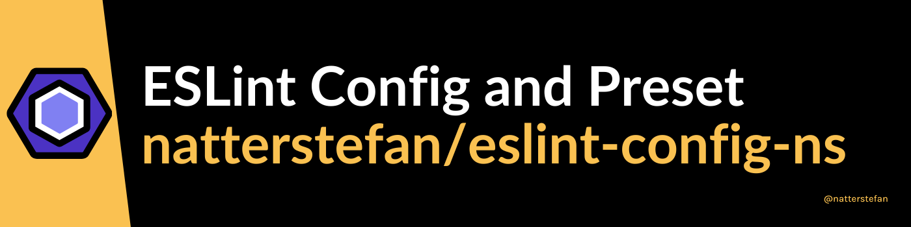

# eslint-config

[](https://github.com/natterstefan/eslint-config-ns/issues)
[](https://github.com/natterstefan/eslint-config-ns/stargazers)
[](https://github.com/natterstefan/eslint-config-ns/blob/main/LICENSE)
[](http://commitizen.github.io/cz-cli/)



## Packages

This monorepo contains multiple packages. Take a look at their READMEs for more
details.

- [eslint-config-ns-base](./packages/eslint-config-ns-base/README.md)
- [eslint-config-ns](./packages/eslint-config-ns/README.md)
- [eslint-config-ns-ts-base](./packages/eslint-config-ns-ts-base/README.md)
- [eslint-config-ns-ts](./packages/eslint-config-ns-ts/README.md)

### How are they related to each other?

### JavaScript

- `eslint-config-ns-base` is the base package for JavaScript projects.
- `eslint-config-ns` extends `eslint-config-ns-base` package and can be used in
  React projects.

### TypeScript

- `eslint-config-ns-ts-base` extends `eslint-config-ns-base` package and is the
  base package for TypeScript projects.
- `eslint-config-ns-ts` is the last one in the chain and extends
  `eslint-config-ns-ts-base` and is best used in React TypeScript projects.

## How to release

This repository uses GitHub Actions
([debug locally](https://github.com/nektos/act)) to create a release and update
the [CHANGELOG](CHANGELOG.md). The implementation is inspired and based on
[github.com/babel/actions](https://github.com/babel/actions/tree/bb571b895aa20aaa3ee4ef58adcde364416acc9a).

Either push the tags after running this command to origin, or run the release
workflow manually on GitHub.

### Manually trigger release

```bash
yarn lerna:version
git push --follow-tags
# wait until GitHub Action finishes and then run
yarn lerna:publish
```

### Manually create Changelog entry

```bash
npx lerna-changelog --from <tag> --to <tag>
```

### Automatically with GitHub Actions

Manually invoke the
[GitHub Action release](https://github.com/natterstefan/eslint-config-ns/actions/workflows/release.yml)
and wait until it finishes.

Once the release was created with GitHub Actions, publish the packages manually
to npm with `yarn lerna:publish`.

Attention: make sure the Pull Requests have labels _before_ you merge them. The
label (e.g. `enhancement` and `bug`) will be used to create the CHANGELOG.

## LICENSE

[MIT](LICENSE)

<!-- prettier-ignore-start -->
<!-- markdownlint-disable -->
<table>
  <tbody>
    <tr>
      <td align="center">
        <a href="https://github.com/natterstefan">
          
          </br>
          Stefan Natter
        </a>
        <div>
          <a href="https://twitter.com/natterstefan">
            
          </a>
        </div>
      </td>
    </tr>
  <tbody>
</table>
<!-- markdownlint-enable -->
<!-- prettier-ignore-end -->
