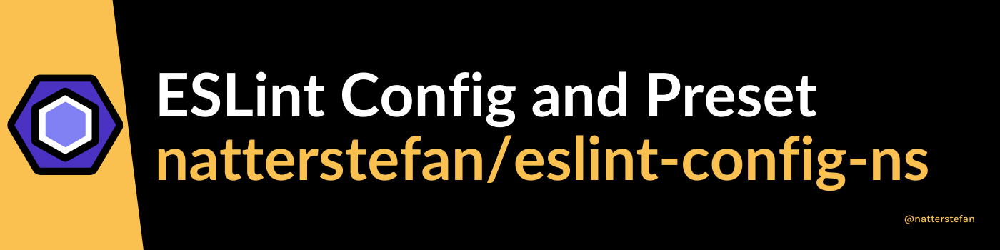

# eslint-config-ns

[](https://github.com/natterstefan/eslint-config-ns/issues)
[](https://github.com/natterstefan/eslint-config-ns/stargazers)
[](https://github.com/natterstefan/eslint-config-ns/blob/main/LICENSE)



A comprehensive ESLint configuration for modern JavaScript and TypeScript
projects, with support for React, Next.js, Jest, and Storybook. This package
uses the new ESLint flat config format.

## Features

- 📏 **Modern ESLint Configuration**: Uses the new ESLint flat config format
- ⚛️ **React Support**: Includes rules for React and React Hooks
- 📘 **TypeScript Support**: Comprehensive TypeScript rules
- 🧪 **Testing**: Jest configuration included
- 📚 **Storybook**: Storybook linting rules
- ⚡ **Next.js**: Support for Next.js projects
- 🎨 **Prettier Integration**: Works seamlessly with Prettier

## Getting Started

1. Install the required dependencies:

```bash
# npm
npm install --save-dev eslint eslint-config-ns prettier

# yarn
yarn add --dev eslint eslint-config-ns prettier

# pnpm
pnpm add --save-dev eslint eslint-config-ns prettier
```

1. Create an `eslint.config.mjs` file in your project root:

```javascript
// eslint.config.mjs
// @ts-check

import { getPresets } from 'eslint-config-ns'

/**
 * @type {Array<import('eslint').Linter.Config>}
 */
export default await getPresets(
  // Base config
  'typescript', // or use 'javascript' for JS-only projects

  // Optional extensions based on your project needs
  'react',
  'jest',
  'prettier',
  // 'next', // Uncomment if using Next.js
  // 'storybook', // Uncomment if using Storybook
)
```

1. Add
   [globals](https://eslint.org/docs/latest/use/configure/language-options#predefined-global-variables)
   (like browser or Node.js APIs) if you need them:

```javascript
// eslint.config.mjs
// @ts-check

import globals from 'globals'
import { getPresets } from 'eslint-config-ns'

/**
 * @type {Array<import('eslint').Linter.Config>}
 */
export default [
  ...(await getPresets('typescript', 'react', 'jest', 'prettier')),
  {
    languageOptions: {
      globals: {
        ...globals.browser,
        ...globals.node,
      },
    },
  },
]
```

### Prettier and TypeScript

1. To set up Prettier, add to your `package.json`:

```json
{
  "prettier": "eslint-config-ns/prettier.config.js"
}
```

1. If you use TypeScript, you can extend the provided tsconfig:

```json
{
  "extends": "eslint-config-ns/tsconfig.json"
}
```

## Usage

Create an `eslint.config.mjs` file in your project root and import the
configurations you need:

```javascript
// @ts-check

import { getPresets } from 'eslint-config-ns'

/**
 * @type {Array<import('eslint').Linter.Config>}
 */
export default await getPresets(
  // 'javascript',
  'jest',
  // 'next', // Uncomment if using Next.js
  'prettier',
  'react',
  'storybook',
  'typescript', // contains JavaScript
)
```

### Available Presets

- `javascript` - Base JavaScript rules
- `jest` - Jest testing rules
- `next` - Next.js rules
- `prettier` - Prettier integration
- `react` - React and JSX rules
- `storybook` - Storybook rules
- `typescript` - TypeScript rules (includes JavaScript rules)

## Configuration Examples

### Basic JavaScript Project

```javascript
// eslint.config.js
import { getPresets } from 'eslint-config-ns'

export default await getPresets('javascript', 'prettier')
```

### React TypeScript Project

```javascript
// eslint.config.js
import { getPresets } from 'eslint-config-ns'

export default await getPresets(
  'typescript', // includes JavaScript rules
  'react',
  'prettier',
)
```

### Next.js Project

```javascript
// eslint.config.js
import { getPresets } from 'eslint-config-ns'

export default await getPresets('typescript', 'react', 'next', 'prettier')
```

### Full-Featured Project

```javascript
// eslint.config.js
import { getPresets } from 'eslint-config-ns'

export default await getPresets(
  'typescript',
  'react',
  'jest',
  'storybook',
  'next',
  'prettier',
)
```

### Custom Rules

You can add your own custom rules by spreading the presets and adding your
configuration:

```javascript
// eslint.config.js
import { getPresets } from 'eslint-config-ns'

export default [
  ...(await getPresets('typescript', 'react', 'prettier')),
  {
    // Your custom rules
    rules: {
      'no-console': 'warn',
      // Add any other custom rules
    },
  },
]
```

## IDE Integration

### VSCode Integration

1. Install the following extensions:

- [ESLint](https://marketplace.visualstudio.com/items?itemName=dbaeumer.vscode-eslint)
- [Prettier](https://marketplace.visualstudio.com/items?itemName=esbenp.prettier-vscode)

1. Add the following to your VSCode settings (`.vscode/settings.json`):

```json
{
  "editor.codeActionsOnSave": {
    "source.fixAll.eslint": "always"
  },
  "editor.defaultFormatter": "esbenp.prettier-vscode",
  "editor.formatOnSave": true
}
```

### CI Integration

To validate your code in a CI pipeline, add the following to your
`package.json`:

```json
{
  "scripts": {
    "lint": "eslint src && prettier src --check"
  }
}
```

## Requirements

- Node.js >=20
- ESLint >=9.x
- Prettier >=3.x

## Contributing

Contributions are welcome! Please feel free to submit a Pull Request.

## Other Configs

- <https://github.com/molindo/eslint-config-molindo>

## LICENSE

[MIT](LICENSE)

<!-- prettier-ignore-start -->
<!-- markdownlint-disable -->
<table>
  <tbody>
    <tr>
      <td align="center">
        <a href="https://github.com/natterstefan">
          
          </br>
          Stefan Natter
        </a>
        <div>
          <a href="https://twitter.com/natterstefan">
            
          </a>
        </div>
      </td>
    </tr>
  <tbody>
</table>
<!-- markdownlint-enable -->
<!-- prettier-ignore-end -->
